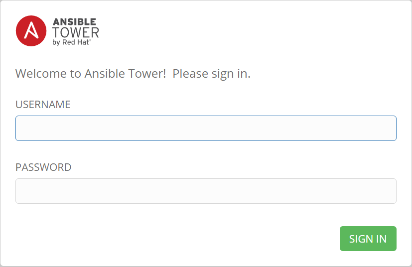

Ansible Tower Demo
=======================
This demo demonstrates how to setup Ansible Tower on an Ubuntu 14.04 host to control Cumulus Linux switches. The demo will go through the process of installing Ansible Tower and setting it up to run a playbook against a group of switches running Cumulus Linux.

This demo is written for the [cldemo-vagrant](https://github.com/cumulusnetworks/cldemo-vagrant) reference topology and applies Ansible playbook from the [cldemo-automation-ansible](https://github.com/cumulusnetworks/cldemo-automation-ansible) demo which references the BGP unnumbered configuration from the  [cldemo-config-routing](https://github.com/cumulusnetworks/cldemo-config-routing) demo.

Before you start
----------------
If you don't already have a license for Ansible Tower, you can get a trial license
for deployments up to 10 devices for free by visiting
[https://www.ansible.com/license](https://www.ansible.com/license). Download this
license and have it available while running the demo.

Installing Ansible Tower
------------------------
Before running this demo, install [VirtualBox](https://www.virtualbox.org/wiki/Download_Old_Builds) and [Vagrant](https://releases.hashicorp.com/vagrant/). The currently supported versions of VirtualBox and Vagrant can be found on the [cldemo-vagrant](https://github.com/cumulusnetworks/cldemo-vagrant).

The reference topology by default only gives 1G of RAM to the `oob-mgmt-server`.
You will need to increase the RAM for the `oob-mgmt-server` to 2G in order for
Ansible Tower to install.

    git clone https://github.com/cumulusnetworks/cldemo-vagrant
    cd cldemo-vagrant
    # edit Vagrantfile and replace v.memory for the oob-mgmt-server from 1024 to 2048
    sed -i 's/v.memory = 1048/v.memory = 2048/g' Vagrantfile
    vagrant up oob-mgmt-server oob-mgmt-switch leaf01 leaf02 spine01 spine02 server01 server02
    vagrant ssh oob-mgmt-server
    sudo su - cumulus
    sudo apt-get install software-properties-common
    sudo apt-add-repository ppa:ansible/ansible
    sudo apt-get update
    sudo apt-get install ansible
    wget https://releases.ansible.com/awx/setup/ansible-tower-setup-latest.tar.gz
    tar xvzf ansible-tower-setup-latest.tar.gz
    cd ansible-tower-setup-*
    # edit ./inventory and set all of the fields with a password to 'vagrant'
    sed -i "s/password=''/password='vagrant'/g" inventory
    sudo ./setup.sh
    git clone https://github.com/cumulusnetworks/cldemo-ansible-tower

*In a new terminal*

    ssh -L 9000:localhost:443 vagrant@localhost -p 2222 -o StrictHostKeyChecking=no
    vagrant

*Alternative to leaving ssh open in a seperate terminal*

Edit your Vagrantfile and add these lines under the "oob-mgmt-server" configuration

      # port forwarding for tower server
      device.vm.network "forwarded_port", guest:8080, host: 8080
      device.vm.network "forwarded_port", guest:443, host: 9000

After the Vagrantfile change run the following command:
    
    sudo vagrant reload

Then open your browser as stated below.

Leave this terminal open for the duration of the demo - this creates an SSH
tunnel that will allow you to use the Ansible website from your host machine.
In Firefox or Chrome, navigate to [https://localhost:9000](https://localhost:9000).
You will receive an error message stating that your connection is not secure.
Go to Advanced and either add an exception or tell it to proceed to localhost
anyway.

Your username is `admin` and your password is `vagrant`

When it asks for a license file, copy and paste your license file from
Red Hat in the box. If you don't have a license, click on the button to
receive a free trial license that can be used for evaluation purposes or in
installations of up to 10 nodes (which is sufficient for these demo purposes).

Setting up the Inventory
------------------------
Your inventory includes all of the hosts, groups, host variables, and group
variables. You need an inventory in order to run Ansible commands.

Navigate to [https://localhost:9000/#/inventories](https://localhost:9000/#/inventories)
and click on the blue cross at the top right of the table to add a new inventory. Create a new inventory
with the following values:

 * Name: **Reference Topology**

Now, in your terminal, run the following commands.

    cd ~/cldemo-ansible-tower
    sudo tower-manage inventory_import --source=./inventory --inventory-name="Reference Topology"

Alternatively, you could manually add the devices and groups one-by one using
the GUI.

Creating Machine Credentials
----------------------------
Machine credentials include the login parameters (passwords, SSH keys) to log
into devices to do jobs. We will use the default: *cumulus/CumulusLinux!*

Navigate to [https://localhost:9000/#/credentials](https://localhost:9000/#/credentials)
and click on the blue cross
at the top right of the table to add a new credential. Create a new credential
with the following values:

 * Name: **CumulusLinux**
 * Does this credential belong to a team or user? **User**
 * User that owns this credential: **admin**
 * Type: **Machine**
 * Username: **cumulus**
 * Password: **CumulusLinux!**
 * Privilege Escalation: **sudo**
 * Privilege Escalation Password: **CumulusLinux!**

Creating a Project
------------------
A project is a collection of playbooks that you can use to create Jobs. A
project generally points to a repo such as a Github or Stash repo where you
can store Ansible playbooks. We will point to the Ansible playbooks we use
in our other demo, https://github.com/cumulusnetworks/cldemo-automation-ansible,
but note that we will be ignoring the variables and hosts in its inventory,
since we use the inventory that we imported directly into Tower.

Navigate to [https://localhost:9000/#/projects](https://localhost:9000/#/projects)
and click on the blue cross
at the top right of the table to add a new project. Create a new project
with the following values:

 * Name: **cldemo-ansible**
 * SCM Type: **git**
 * SCM Url: **https://github.com/cumulusnetworks/cldemo-automation-ansible**

After creating the project, refresh the page periodically - when the repo is
successfully downloaded, a green dot will appear to the left of its name.

Creating a Job Template
-----------------------
Navigate to [https://localhost:9000/#/job_templates](https://localhost:9000/#/job_templates)
and click on the blue cross
at the top right of the table to add a new template. Create a new template
with the following values:

 * Name: **Deploy BGP**
 * Job Type: **Run**
 * Inventory: **Reference Topology**
 * Project: **cldemo-ansible**
 * Playbook: **run-demo.yml**
 * Machine Credential: **CumulusLinux**
 * Enable Privilege Escalation: **True**

After creating the job template, click on the rocket icon to run it.
